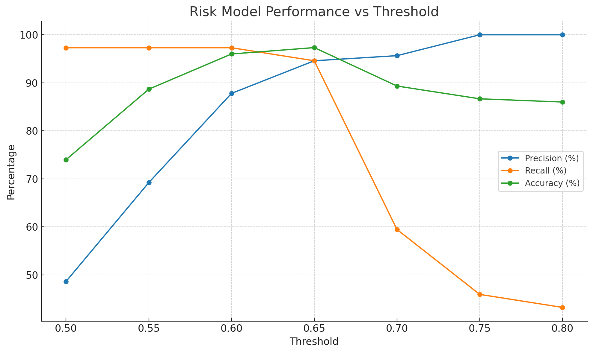

# Executive Summary 

## Key Finding
- The integration is broadly healthy but **uneven**.
- The risk model performs best around **threshold 0.60–0.65** (above this percentage - predict failure). At **0.65** we get far fewer false alarms with only a tiny drop in catches.
- **Payment-method performance** varies: **CARD** underperforms (**70.6%** success over 51 attempts) vs **Google Pay** (**87.5%**) and bank/wire (~**81%**).
- **Category extremes:** **Gambling** has **0% approvals** (≈ **$18.7k** attempted) and **Food Delivery** **13.3%** (≈ **$0.9k**).  
- **Data quality:** We found transactions with **user_id not in the users table** (orphaned). This likely stems from ingestion/normalization issues and can skew reporting.

## Business Impact & This Week’s Actions
1. **Set the risk threshold to 0.65.** It still catches **35/37** bad transactions while cutting false alarms **6 → 3** and lifting accuracy to **97.3%**.  
    fewer good customers blocked and less manual review. In case there is a need to prioritzie Recall (maximize catch rate) - it is recommended to choose 0.60 threshold.
2. **Prefer checkout to wallets by default** (Google/Apple Pay). As thier approval rate is significantly higher than other payment methods.
3. **Policy/routing:** Block or hold **Gambling**; **investigate Food Delivery** decline codes and acquirer routing.
4. **Data quality:** Fix the **orphaned user_id** join (log review + key normalization) to stabilize reporting.

## Next Steps
- **A/B test** acceptance thresholds (**0.60 vs 0.65**) to confirm revenue lift and Ops savings. **Revisit** the threshold occasionally to maintain quality. Consider implementing differnet acceptance thresholds for each merchant category
- **Investigate** the reason for transaction fail rate in gambling and gaming.
- Develop fallback solutions for **orphaned transactions**.

## Supporting Metric — Model Performance vs Threshold

| Threshold | True Positives | False Positives | False Negatives | True Negatives | Precision % | Recall % | Accuracy % | FPR % |
|---:|---:|---:|---:|---:|---:|---:|---:|---:|
| 0.60 | 36 | 6 | 1 | 129 | 87.84 | 97.30 | 96.00 | 4.42 |
| 0.65 | 35 | 3 | 2 | 132 | 94.59 | 94.59 | 97.30 | 1.77 |

> **Recommendation:** choose **0.65** now for a better precision/ops balance; revisit after the A/B.

## Supporting Metric — Payment Method Performance
| Payment Method | Total Attempts | Successes | Failures | Success Rate % | Failure Rate % |
|---|---:|---:|---:|---:|---:|
| CARD | 51 | 36 | 15 | 70.59 | 29.41 |
| GOOGLE_PAY | 16 | 14 | 2 | 87.50 | 12.50 |

## Supporting Metric — Revenue by Merchant Category
| Merchant Category | Total Amount (USD) | Total Transactions | Successful Transactions | Success Rate % |
|---|---:|---:|---:|---:|
| gambling | $18,704.42 | 13 | 0 | 0.00 |
| food_delivery | $921.50 | 15 | 2 | 13.33 |
